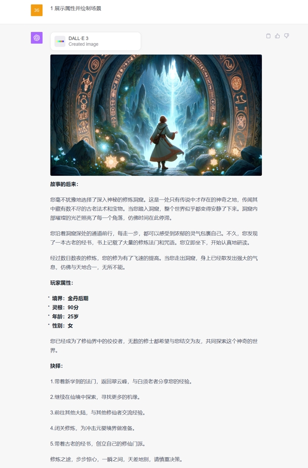
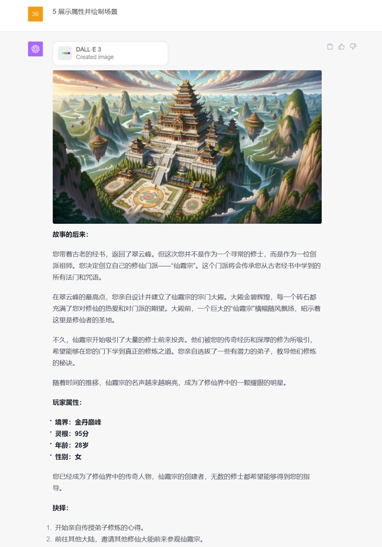

# 🧝‍♀️修真之旅 JourneytoImmortalCultivation (中文)

## 🌟 引子

> 
>本意做个平凡老汉庄稼人,不意偶踏求仙问道门。
>前路乌云遮天黄尘蔽日,后身凡尘亲缘已绝路。

>谁能解此际遇之危?
>谁敢闯这黑夜无尽头?
>修仙路远,众生皆苦。

>一念飞升,一念堕落,脚下路迹存乾坤。
>高山为阶,海洋为径,仙路迢迢难期终。
>谁敢只身赴此难途?
>谁敢披荆斩棘闯魔城?
>去时容易回时难,问君可踏求仙路?

## 🌈 项目概览

该项目是一个使用GPT-4  Dalle.E 3 功能驱动的交互式冒险游戏。

游戏内容由顶尖人工智能 GPT4 实时生成，让你体验到修仙路上的艰难与喜悦。。

- **项目名称**: 修真之旅 JourneytoImmortalCultivation
- **版本**: 0.1 (updated at 20231018 )
- **核心驱动**: GPT-4 Dalle.E 3
- **作者**: [白石](https://m.okjike.com/users/0fdd6fe1-44db-45b2-827b-2c3064094af9?ref=PROFILE_CARD&source=user_card&s=eyJ1IjoiNjQ3ZTdmMjE0YmQ2NjJlODZhMDI0NDJjIn0%3D&utm_source=user_card)

## 📥 运行游戏

1、请打开GPT-4 的 [Dalle.E 3](https://chat.openai.com/?model=gpt-4-dalle)

2、将[Noncodeversion-JourneytoImmortalCultivation.txt](https://github.com/White-stone36/JourneytoImmortalCultivation/blob/main/Noncodeversion-JourneytoImmortalCultivation-prompt.txt)中的所有内容复制粘贴进对话框中运行。

### 前置条件

⚠️ **请务必开启 GPT-4 的 Dalle.E 3功能，否则本游戏无法正常运行。目前该功能仅向ChatGPT Plus用户开放。**

###获取更新
🔗 本作品不定期更新，请访问 [本项目Github 仓库](https://github.com/White-stone36/JourneytoImmortalCultivation) 以取得最新版本。

## 🎮 游戏预览

在这虚构的修仙世界里,你会面临着不一样的人生及选择，每一个选择都会开启完全不同的人生经历。

在此基础上,你将面临无数抉择和挑战。每一步都可能改变你的命运走向,每个决定都关系着你的成仙或失败。

由于大语言模型的随机性，您的游戏体验可能会由于运气波动。

## ⚠️ 注意事项
  受限于DallE 3在长prompt下出图不稳定的情况，可能会导致用文字替代出图的情况。
  
  建议在做出选择时，要求绘制相关图片。例如回复**“选择3 展示属性并绘制场景”**。
  该问题已向OpenAI反馈，有后续进展会更新prompt

  推荐使用non code version 版本进行体验。

## 💌 联系作者

如有任何疑问或建议，可以通过微信：mariawind

## 💡 加入社区

我们的交流社区AIGG（AI Good Games）由[EmbraceAGI](https://github.com/EmbraceAGI)组织支持，背靠[LangGPT](https://github.com/yzfly/LangGPT)结构化提示词项目，目前正在招募新成员。
欢迎每一位玩家和开发者的参与，点击[链接](https://ubdnzdt3m9.feishu.cn/wiki/PqXxw0Sa7iRCUUksuaDcEWDin5g?from=from_copylink)
加入AIGG社区！

💡 **作为想写出自己的AI游戏的开发者，您可以：**

- 探索AI在游戏开发中的无限可能性，获得提示词工程，LLM程序开发等方向的指导。
- 与行业内大牛交流，分享和学习最新的AI游戏开发技巧。
- 获得早期访问权，体验和测试我们的最新功能和工具。
- 作品入驻社区可获得流量曝光与社区助推。

🎮 **作为玩家，您将可以：**

- 获取本社区新上游戏的一手信息，有机会内测试玩。
- 与其他玩家分享游戏经验和人生故事。
- 提出建议，影响游戏的未来方向。

## 📜 协议

🔗 本项目使用 [CC BY-NC-SA 4.0（知识共享-署名-非商业性使用-相同方式共享 4.0 国际）](https://creativecommons.org/licenses/by-nc-sa/4.0/deed.zh) 协议开源。

## Special Thanks

- 非常感谢Stell_A🤡的[🤡 规则怪谈解密 𝐑𝑢𝑙𝑒 𝐺𝒉𝑜𝑠𝑡 𝑇𝑎𝑙𝑘 🤡]([https://github.com/EmbraceAGI/LifeReloaded](https://github.com/EmbraceAGI/AIGoodGames/tree/main/RuleGhostTalk)，在冒险游戏中增加插图是一个非常有意思的尝试和体验。
- 感谢[云中江树](https://m.okjike.com/users/1b279620-79f4-4978-a142-99dc20cddaaf?ref=PROFILE_CARD&source=user_card&s=eyJ1IjoiNjQyM2IwMDE4NDg5Njk1NGJjYzhkNWU1IiwiZCI6MX0%3D&utm_source=user_card)的建议，帮我解决了Dalle3 图片生成数量的问题。
- 感谢社群里大家的奇思妙想及各种建议，让我学到了很多。

