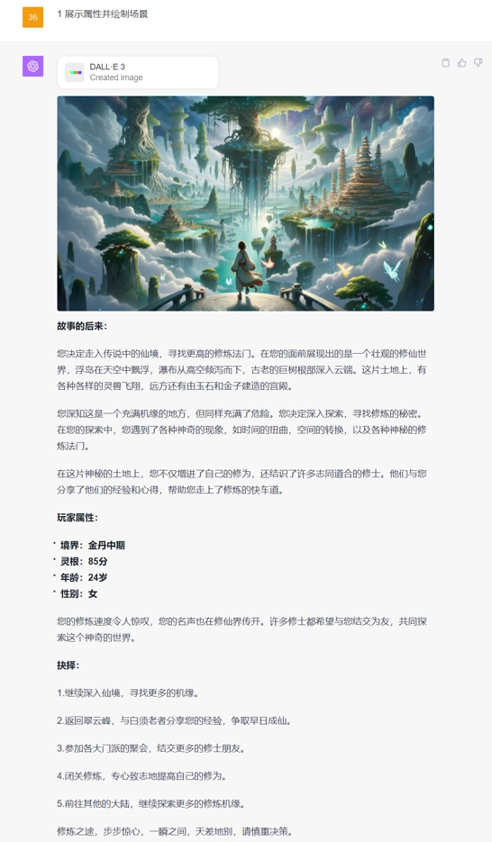

# 🧝‍♀️修真之旅 JourneytoImmortalCultivation (中文)

## 🌟 引子

> 
>修仙路远，众生皆苦。
> 一念飞升，一念堕落，脚下路迹存乾坤。
> 
>去时容易回时难，后身凡尘亲缘已绝路。
> 
>问君可敢踏求仙路?

## 🌈 项目概览

该项目是一个使用GPT-4  Dall.E 3 功能驱动的交互式冒险游戏。

游戏内容由顶尖人工智能 GPT4 实时生成，让你体验到修仙路上的艰难与喜悦。。

- **项目名称**: 修真之旅 JourneytoImmortalCultivation
- **版本**: 0.2 (updated at 20231102 )
- **核心驱动**: GPT-4 Dall.E 3
- **作者**: [白石](https://m.okjike.com/users/0fdd6fe1-44db-45b2-827b-2c3064094af9?ref=PROFILE_CARD&source=user_card&s=eyJ1IjoiNjQ3ZTdmMjE0YmQ2NjJlODZhMDI0NDJjIn0%3D&utm_source=user_card)

## 🚀 特性
1、GPT驱动的不可预测剧情🌀：你认为你知道将要发生什么吗？想都别想！由GPT自动生成的剧情📜，每一次都是新的体验，甚至连游戏的开发者都不知道下一刻会发生什么😲。你就像是被扔进了一个不断旋转的迷宫中🌀，谁也不知道出口在哪里。😜

2、DallE3绘制的沉浸式场景🎨：使用Dalle绘制的场景，不仅仅是像素和色彩的堆砌🌆。它会根据剧情和情境自动调整，带你进入一个更加真实的虚拟世界🌍，让你仿佛置身其中，与角色一同感受每一次的喜怒哀乐😢😂。

3、三种修仙世界的随机选择🌌：都市修仙🏙️、豪门修仙🏰、西幻修仙🌌，三种截然不同的修仙世界，每次进入游戏都可能遭遇不同的世界设定。你可能是都市中的隐士🧙‍♂️，也可能是豪门中的大少🤴，或者是西幻世界的英雄⚔️。这种不确定性增加了游戏的趣味性和再玩性🎮。

4、真·随机的人生体验🎲：结合GPT-4的高级数据分析功能📊，每一次游戏都会为你生成一个真·随机的人生路径🛤️。你可能在一次游戏中成为天才🎓，下一次却是个平凡人🚶‍♂️。这种随机性让每次游戏都充满了挑战和新鲜感🎉

## 📥 运行游戏

1、请打开GPT-4 的 [Dall.E 3](https://chat.openai.com/?model=gpt-4-dalle)

2、将[Noncode+English version-JourneytoImmortalCultivation-prompt.txt]([https://github.com/White-stone36/JourneytoImmortalCultivation/blob/main/Noncodeversion-JourneytoImmortalCultivation-prompt.txt](https://github.com/White-stone36/JourneytoImmortalCultivation/blob/main/Noncode%2BEnglish%20version-JourneytoImmortalCultivation-prompt.txt))中的所有内容复制粘贴进对话框中运行。

### 前置条件

⚠️ **请务必开启 GPT-4 的 Dall.E 3功能，否则本游戏无法正常运行。目前该功能仅向ChatGPT Plus用户开放。**

### 获取更新
🔗 本作品不定期更新，请访问 [本项目Github 仓库](https://github.com/White-stone36/JourneytoImmortalCultivation) 以取得最新版本。

## ⚠️ 注意事项
  受限于DallE 3在长prompt下出图不稳定的情况，可能会导致用文字替代出图的情况。
  
  建议在做出选择时，要求绘制相关图片。例如回复**选择3 生成1张图片并回到我的游戏，根据规则生成抉择选项**。
  目前DallE3的constrain不定时更新，**强烈建议** 按照格式回复游戏选项🥺🥺🥺

  DallE3更新后，原prompt超出最新的token限制，推荐使用non code-English version 版本进行体验。

## 🎮 游戏预览

在这虚构的修仙世界里,你会面临着不一样的人生及选择，每一个选择都会开启完全不同的人生经历。

在此基础上,你将面临无数抉择和挑战。每一步都可能改变你的命运走向,每个决定都关系着你的成仙或失败。

由于大语言模型的随机性，您的游戏体验可能会由于运气波动。

## 💌 联系作者

如有任何疑问或建议，可以通过微信：mariawind

## 💡 加入社区

我们的交流社区AIGG（AI Good Games）由[EmbraceAGI](https://github.com/EmbraceAGI)组织支持，背靠[LangGPT](https://github.com/yzfly/LangGPT)结构化提示词项目，目前正在招募新成员。
欢迎每一位玩家和开发者的参与，点击[链接](https://ubdnzdt3m9.feishu.cn/wiki/PqXxw0Sa7iRCUUksuaDcEWDin5g?from=from_copylink)
加入AIGG社区！

💡 **作为想写出自己的AI游戏的开发者，您可以：**

- 探索AI在游戏开发中的无限可能性，获得提示词工程，LLM程序开发等方向的指导。
- 与行业内大牛交流，分享和学习最新的AI游戏开发技巧。
- 获得早期访问权，体验和测试我们的最新功能和工具。
- 作品入驻社区可获得流量曝光与社区助推。

🎮 **作为玩家，您将可以：**

- 获取本社区新上游戏的一手信息，有机会内测试玩。
- 与其他玩家分享游戏经验和人生故事。
- 提出建议，影响游戏的未来方向。

## 📜 协议

🔗 本项目使用 [CC BY-NC-SA 4.0（知识共享-署名-非商业性使用-相同方式共享 4.0 国际）](https://creativecommons.org/licenses/by-nc-sa/4.0/deed.zh) 协议开源。

## Special Thanks

- 非常感谢Stell_A🤡的[🤡 规则怪谈解密 𝐑𝑢𝑙𝑒 𝐺𝒉𝑜𝑠𝑡 𝑇𝑎𝑙𝑘 🤡]([https://github.com/EmbraceAGI/LifeReloaded](https://github.com/EmbraceAGI/AIGoodGames/tree/main/RuleGhostTalk)，在冒险游戏中增加插图是一个非常有意思的尝试和体验。
- 感谢[云中江树](https://m.okjike.com/users/1b279620-79f4-4978-a142-99dc20cddaaf?ref=PROFILE_CARD&source=user_card&s=eyJ1IjoiNjQyM2IwMDE4NDg5Njk1NGJjYzhkNWU1IiwiZCI6MX0%3D&utm_source=user_card)的建议，帮我解决了Dalle3 图片生成数量的问题。
- 感谢社群里大家的奇思妙想及各种建议，让我学到了很多。

